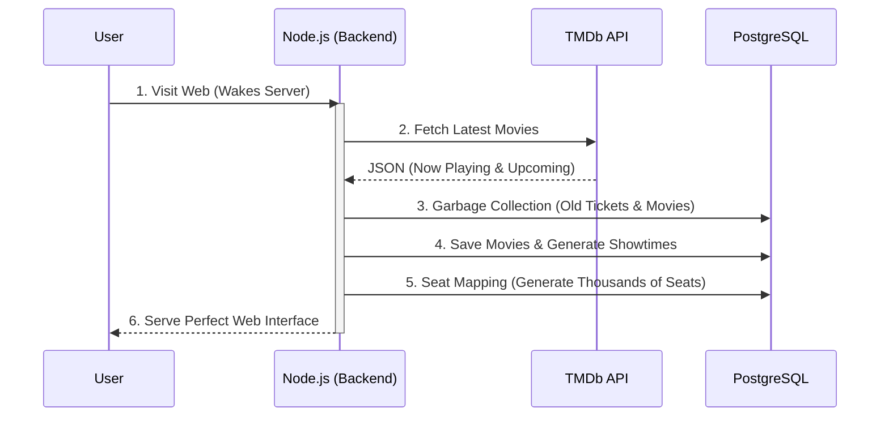

## Background

This project was built to solve one of the most challenging problems in e-commerce systems: handling high-concurrency traffic and maintaining real-time data integrity.

**Specific problem:** When 100 users simultaneously click the same seat, how do you guarantee that only 1 person books successfully while the other 99 receive an instant notification?

## Technical Solution

### Redis Distributed Lock

```javascript
const lockKey = `seat:${movieId}:${seatId}`;
const acquired = await redis.set(lockKey, userId, 'EX', 30, 'NX');
// EX 30 — auto-expire after 30s (prevents deadlock if server crashes)
// NX    — only set if key does not exist (atomic check-and-set)

if (!acquired) {
  socket.emit('seat:error', { message: 'Seat already taken' });
  return;
}

await db.query(
  'UPDATE seats SET status=$1, user_id=$2 WHERE id=$3',
  ['locked', userId, seatId]
);

io.to(`room:${movieId}`).emit('seat:updated', { seatId, status: 'locked' });
```

**Why Redis instead of a DB transaction?** PostgreSQL row-locks work, but when scaling horizontally across multiple Node processes, each process has its own connection pool — the lock is not shared. Redis is single-threaded and guarantees atomicity cross-process.

### Socket.io Room Management

Each showtime is a Socket.io room. Clients join the room when they open the seat-selection page and leave when they exit. Seat-map updates are broadcast to the entire room — no polling needed.

## Self-Healing Architecture

**Problem:** Demo projects are often abandoned after a few months. When recruiters visit, they see outdated movie schedules from last year and empty data.

**Solution:** Integrated a Background Cronjob with the TMDb API. Even if the system goes to "sleep" on a free host, the moment a user visits, the server automatically wakes up, fetches new movies, generates thousands of seats, and performs garbage collection on old tickets. The project is 100% self-sustaining and maintenance-free.



## Load Testing

```bash
# 100 virtual users all selecting seat ID 42
artillery run load-test.yml

# Results:
# Success (seat booked): 1
# Failed (seat taken): 99
# Response time p95: 187ms
# Double bookings: 0
```

## Bugs & Fixes

**Bug 1 — Redis lock not released on server crash:** TTL was 30s, but if the server crashed mid-flow, the seat stayed locked. Fix: reduced TTL to 10s and added a heartbeat to extend the lock while the user is in the payment flow.

**Bug 2 — Socket reconnect loses seat state:** After reconnecting, the client had no way to know which seats were locked. Fix: when joining a room, the server now emits the full current seat-map from Redis.

## Results

- Zero double bookings across load tests with 100 concurrent users
- Response time p95: 187ms
- Project grade: 9/10
