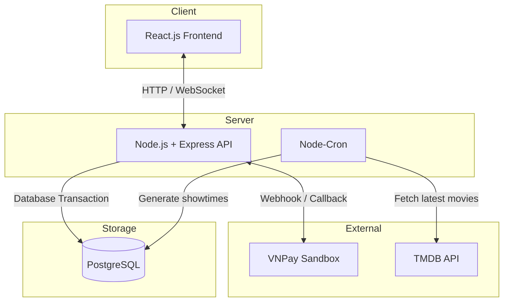

## Bối cảnh

DHLCinema là hệ thống đặt vé xem phim trực tuyến hỗ trợ chọn ghế thời gian thực, đặt vé, thanh toán và quản trị rạp chiếu. Trọng tâm của dự án là duy trì tính nhất quán về trạng thái ghế ngồi khi có nhiều người dùng cùng lúc nỗ lực đặt chung một vị trí.

## Tính năng chính

**Đặt vé & giữ ghế:** Ghế được tạm giữ trong thời gian giới hạn, sau đó tự động giải phóng nếu giao dịch không hoàn tất.
**Đồng bộ trạng thái thời gian thực:** Socket.IO cập nhật thay đổi trạng thái ghế cho các client đang xem cùng suất chiếu.
**Thanh toán VNPay:** Tích hợp VNPay Sandbox với callback/webhook để xác nhận trạng thái giao dịch.
**Tự động đồng bộ dữ liệu phim:** Node-Cron định kỳ lấy dữ liệu từ TMDB và cập nhật vào hệ thống.

## Đóng góp của tôi

- **Thiết kế** cơ chế giữ ghế bằng Database Transaction (Prisma), kết hợp thời gian hết hạn và cleanup job để xử lý ghế bị giữ quá hạn.
- **Xây dựng** cơ chế đồng bộ trạng thái thời gian thực bằng Socket.IO giữa Frontend và Backend.
- **Tích hợp** VNPay Sandbox, xây dựng webhook và xác thực chữ ký HMAC SHA512 trước khi cập nhật trạng thái giao dịch.
- **Phát triển** Cron job chạy nền trên Node.js để tự động đồng bộ dữ liệu phim và giải phóng các ghế giữ quá hạn.

## Kiến trúc

Hệ thống sử dụng kiến trúc phân tách hiện đại:
- **Client**: Ứng dụng React.js SPA quản lý giao diện và trạng thái.
- **Server**: API Node.js & Express, kết hợp Socket.io cho giao tiếp hai chiều.
- **Database**: PostgreSQL (qua Prisma ORM) lưu trữ dữ liệu người dùng, phim, suất chiếu, ghế và giao dịch.
- **Automation Engine**: Node-Cron định kỳ gọi API TMDb và xử lý các tác vụ định kỳ (cleanup).

## Thách thức Kỹ thuật

**Xử lý tranh chấp ghế đồng thời (Concurrency):**
- **Bối cảnh:** Khi nhiều người dùng chọn cùng một ghế ở cùng một thời điểm, cơ sở dữ liệu thông thường sẽ bị lỗi đặt trùng (Double-booking).
- **Giải pháp:** Sử dụng Database Transaction để kiểm tra và cập nhật trạng thái ghế trong cùng một luồng xử lý.
- **Thách thức phát sinh:** Người dùng có thể khóa ghế nhưng không bao giờ thanh toán, dẫn đến việc ghế bị "giam" vĩnh viễn.
- **Cách khắc phục:** Thiết lập thời gian khóa (TTL) là 5 phút trong cơ sở dữ liệu, đồng thời xây dựng tiến trình dọn dẹp (Cleanup Job) chạy ngầm để giải phóng các ghế quá hạn.

**Đồng bộ trạng thái thời gian thực:**
- **Bối cảnh:** Mỗi suất chiếu là một phòng (Socket.io room).
- **Vấn đề:** Khi một ghế được đặt, các client khác trong phòng cần biết ngay lập tức để cập nhật giao diện mà không cần làm mới trang.
- **Cách giải quyết:** Server sử dụng WebSockets (qua Socket.io) để phát sóng (broadcast) sự kiện thay đổi trạng thái ghế đến tất cả người dùng khác đang xem cùng suất chiếu đó.

## Quyết định Kỹ thuật

**Đồng bộ dữ liệu phim tự động (Automated Data Sync):**
- **Vấn đề:** Các dự án Demo thường hiển thị dữ liệu cũ rích hoặc trống rỗng sau vài tháng bị bỏ quên. 
- **Quyết định:** Tích hợp Node-Cron kết hợp API của The Movie Database (TMDb). 
- **Triển khai:** Mỗi ngày vào lúc 1 giờ sáng, hệ thống tự động kéo danh sách phim mới nhất, sinh hàng ngàn ghế ngồi cho các suất chiếu và dọn dẹp vé cũ (trước 7 ngày). 
- **Lý do:** Giữ cho dự án luôn sống động và sẵn sàng để demo mà không tốn chi phí bảo trì hệ thống thủ công.

**Quản lý giao dịch E-commerce:**
- **Vấn đề:** Làm sao để không phát hành vé nếu người dùng thanh toán thất bại, nhưng cũng không giữ ghế vĩnh viễn. 
- **Quyết định:** Tách luồng "Giữ chỗ" và "Thanh toán". 
- **Triển khai:** Ghế chỉ được đánh dấu "Đã bán" trong Database khi và chỉ khi Webhook từ VNPay gửi tín hiệu thành công về Server, được xác thực bằng chữ ký hash (HMAC SHA512).

## Kết quả

- **Xử lý đặt ghế đồng thời**: Triển khai cơ chế giữ ghế có thời hạn và xử lý trạng thái thông qua Database Transaction.
- **Đồng bộ thời gian thực**: Cập nhật trạng thái ghế giữa các client thông qua Socket.IO.
- **Thanh toán**: Tích hợp VNPay Sandbox và xác thực callback trước khi cập nhật trạng thái giao dịch.
- **Tự động hóa**: Sử dụng Node-Cron để đồng bộ dữ liệu phim từ TMDB và xử lý các tác vụ định kỳ.
