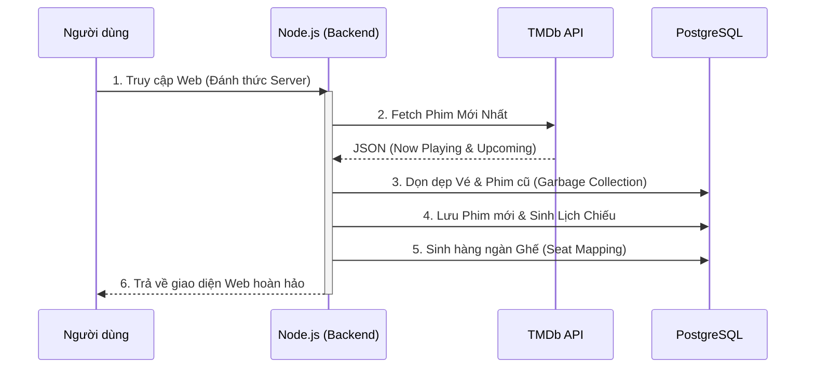

## Bối cảnh

Đây là đồ án môn học **Lập trình Mạng** (Học kỳ 1 / 2024), được thực hiện bởi nhóm 3 sinh viên. Yêu cầu: xây dựng một hệ thống thời gian thực có khả năng xử lý bài toán tranh chấp dữ liệu (race conditions).

**Vấn đề cụ thể:** Khi có 100 người dùng cùng lúc bấm chọn mua cùng một ghế ngồi, làm sao để đảm bảo chắc chắn chỉ có 1 người đặt thành công, trong khi 99 người còn lại sẽ nhận được thông báo ngay lập tức?

## Giải pháp Kỹ thuật

### Distributed Lock với Redis

```javascript
const lockKey = `seat:${movieId}:${seatId}`;
const acquired = await redis.set(lockKey, userId, 'EX', 30, 'NX');
// EX 30 — tự động hết hạn sau 30 giây (tránh kẹt lock nếu server sập)
// NX    — chỉ set nếu key chưa tồn tại (atomic check-and-set)

if (!acquired) {
  socket.emit('seat:error', { message: 'Seat already taken' });
  return;
}

await db.query(
  'UPDATE seats SET status=$1, user_id=$2 WHERE id=$3',
  ['locked', userId, seatId]
);

io.to(`room:${movieId}`).emit('seat:updated', { seatId, status: 'locked' });
```

**Tại sao lại chọn Redis thay vì Transaction của Database?** Row-locks (khóa dòng) của PostgreSQL chạy tốt, nhưng khi mở rộng theo chiều ngang (scale horizontally) trên nhiều process Node.js, mỗi process sẽ có một connection pool riêng — do đó lock không được chia sẻ chung. Redis chạy đơn luồng (single-threaded) và đảm bảo tính nguyên tử (atomicity) trên nhiều process.

### Quản lý phòng bằng Socket.io

## Kiến trúc Tự phục hồi (Self-Healing Architecture)

**Vấn đề:** Các dự án Demo thường bị bỏ xó sau vài tháng. Khi nhà tuyển dụng truy cập, họ sẽ thấy lịch chiếu từ năm ngoái và dữ liệu trống rỗng.

**Giải pháp:** Tích hợp Background Cronjob và API của TMDb (The Movie Database). Dù hệ thống có bị "ngủ đông" (sleep) trên host miễn phí, thì ngay khi có lượt truy cập đầu tiên, server sẽ tự động thức dậy, kéo phim mới, tự sinh hàng ngàn ghế và dọn dẹp rác (vé cũ). Dự án tự vận hành 100% không cần bảo trì.



## Load Testing (Kiểm thử tải)

```bash
# Giả lập 100 người dùng cùng lúc chọn ghế ID 42
artillery run load-test.yml

# Kết quả:
# Thành công (ghế được đặt): 1
# Thất bại (ghế đã có người đặt): 99
# Thời gian phản hồi p95: 187ms
# Số ca bị trùng ghế (Double bookings): 0
```

## Lỗi & Khắc phục

**Lỗi 1 — Lock của Redis không được nhả ra khi server sập:** TTL ban đầu là 30s, nhưng nếu server crash ngay giữa chừng, ghế đó sẽ bị khóa cứng. Khắc phục: giảm TTL xuống còn 10s và thêm cơ chế heartbeat để gia hạn lock liên tục trong thời gian người dùng đang ở trang thanh toán.

**Lỗi 2 — Reconnect mất trạng thái ghế:** Sau khi rớt mạng và reconnect, client không có cách nào biết ghế nào đã bị khóa. Khắc phục: khi client join vào phòng, server sẽ gửi ngay toàn bộ sơ đồ ghế hiện tại đang được lưu trong Redis.

## Kết quả

- Không xảy ra bất kỳ trường hợp đặt trùng ghế nào (Zero double bookings) trong load test với 100 người dùng đồng thời.
- Thời gian phản hồi p95: 187ms.
- Điểm số đồ án: 9/10
